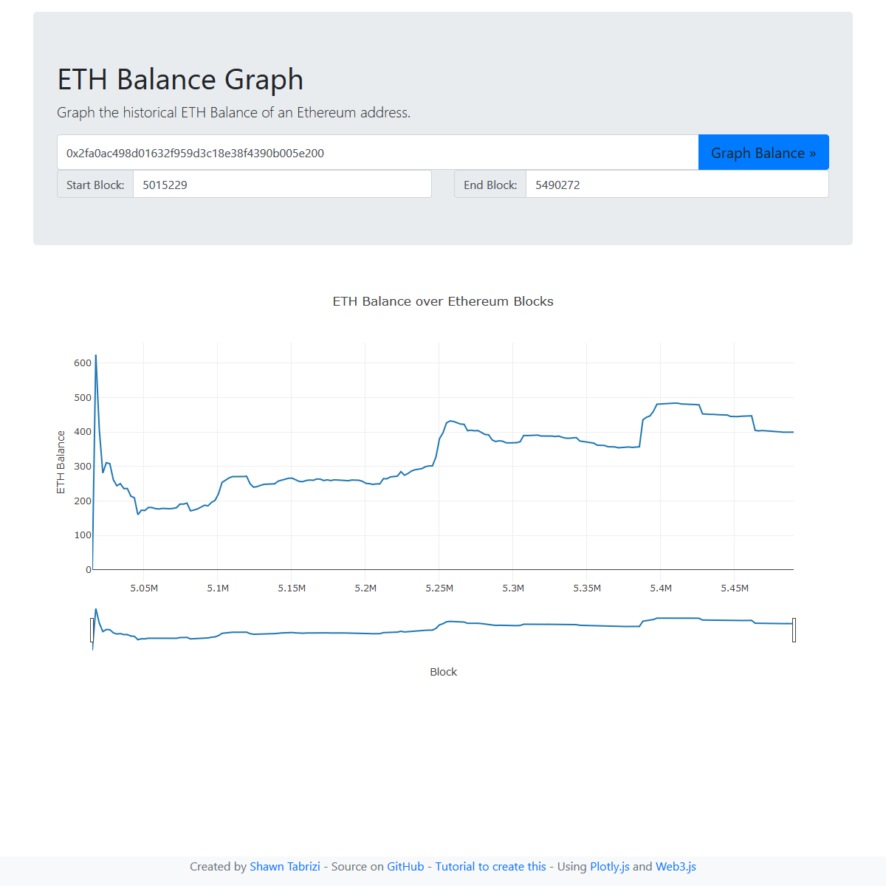

# ETH Balance Graph

Graph the historical ETH balance of any Ethereum address over time. Zoom into any block range to automatically fetch higher-resolution data.

**Try it out: [shawntabrizi.com/ethgraph](https://shawntabrizi.com/ethgraph/)**



## How It Works

1. Enter an Ethereum address (or use the default)
2. Optionally set a start/end block range
3. Click "Graph Balance" to plot the balance history
4. Zoom into the chart to automatically load more data points for that range

Uses [ethers.js](https://docs.ethers.org/) to query historical balances from a public RPC endpoint and [Plotly.js](https://plotly.com/javascript/) for interactive charts. The [Etherscan API](https://etherscan.io/apis) finds the first transaction block for an address.

## Shareable URLs

The URL updates with querystring parameters as you use the app, making it easy to share a specific view:

```
https://shawntabrizi.com/ethgraph/?address=0x2fa0...&start=5000000&end=10000000
```

## Related Projects

- [ETH Balance](https://github.com/shawntabrizi/ethbalance) — Get the ETH balance of an address
- [ERC-20 Token Balance](https://github.com/shawntabrizi/ERC20-Token-Balance) — Query ERC-20 token balances

## License

[MIT](LICENSE)
